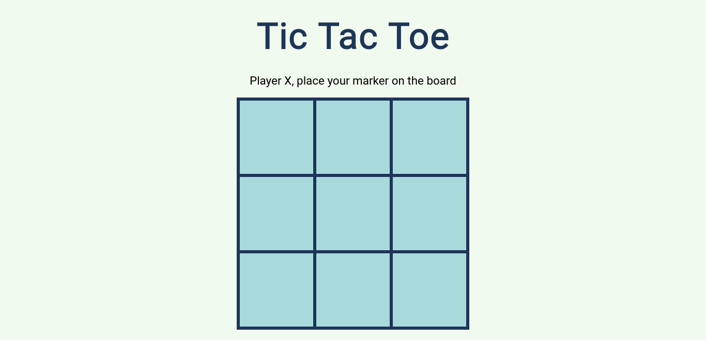

# Tic Tac Toe
A simple implementation of the classic two-player game Tic Tac Toe using vanilla JavaScript.

## Preview
Start playing the game by clicking [this](https://neil-justin.github.io/tic-tac-toe/)

## Objectives
In this project, that is part of [The Odin Project](theodinproject.com) curriculum, we are tasked to create this simple two-player gameboard game with factory functions and module patterns being our main tools to logically organized our code. We are also told to avoid populating the global scope as much as possible and instead try to tucked away each functionalities inside their corresponding closure.

## Experience
When I started the project, I was uncertain about the placement of each functionalities. What I think helps me to overcome this uncertainty was by being mindful of the main purpose of each functionalities. I also find myself wondering about which data should be private, and which should be in public. As I work through it, apparently, any data that I don't want to be access outside of its corresponding closure should be made private.

## Acknowledgement
 This project was made possible by [The Odin Project](theodinproject.com) — a community-supported, open-source website that teaches full-stack web development for free.